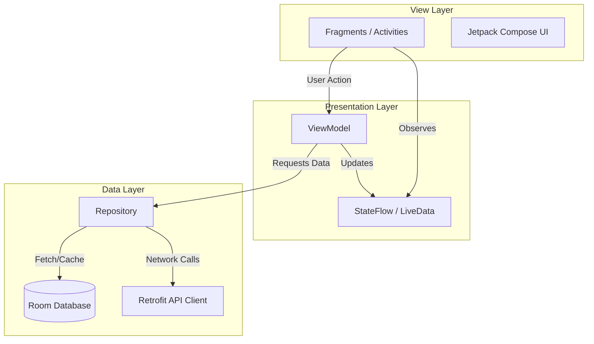

<p align="center">
  
</p>

<h1 align="center">SwaSurvey App: Deep Dive Architecture</h1>

<p align="center">
  <strong>Android Mobile Application Engineering Specification</strong>
</p>

---

## 1. Core Architecture Pattern: MVVM + Clean Architecture

The SwaSurvey Android App is built strictly following the **Model-View-ViewModel (MVVM)** pattern combined with Google's Jetpack architecture components. This ensures maximum stability, testability, and adherence to Android's modern development standards.



---

## 2. Offline-First Synchronization Engine

The defining feature of the SwaSurvey app is its ability to operate deep in agricultural fields without internet connectivity.

### 2.1. Local Persistence (Room)
All data structures (Profiles, Land Records, Draft Claims) are stored locally in SQLite via the Room ORM. 

```kotlin
@Entity(tableName = "claims")
data class ClaimEntity(
    @PrimaryKey val id: String = UUID.randomUUID().toString(),
    val cropName: String,
    val lat: Double,
    val lng: Double,
    val imagePath: String,
    var syncStatus: SyncState = SyncState.PENDING
)
```

### 2.2. Background Synchronization (WorkManager)
When a farmer creates a claim offline, the `syncStatus` is `PENDING`. We enqueue a `OneTimeWorkRequest` via `WorkManager`.
- **Constraints:** The worker is constrained to run only when `NetworkType.CONNECTED` is true.
- **Execution:** Once the device hits a cellular tower, the OS wakes up the worker. It fetches all `PENDING` claims, uploads them via Retrofit multipart requests, and updates the local status to `SYNCED`.

---

## 3. On-Device AI Inference

To provide immediate value to the farmer without relying on cloud processing, the app includes an embedded AI engine.

### 3.1. TensorFlow Lite Integration
The app packages a quantized TFLite model (`crop_disease_v1_opt.tflite`).
- **Processing:** When a photo is taken, the bitmap is scaled and converted to a `ByteBuffer`.
- **Inference:** The model executes locally in milliseconds, returning an array of probabilities.
- **Action:** If a disease like "Late Blight" is detected with >80% confidence, the app immediately displays local, organic remediation steps to the farmer, even offline.

---

## 4. Location & Hardware Security

Validating that a photo was actually taken in a specific field is a critical anti-fraud measure.

### 4.1. Fused Location Provider
The app utilizes Google Play Services `FusedLocationProviderClient` to achieve high-accuracy GPS locks by fusing GPS, Wi-Fi, and cellular triangulation data.

### 4.2. Exif Cryptographic Stamping
To prevent farmers from uploading pre-existing photos downloaded from the internet:
1. The app forces the use of the in-app camera (via `CameraX`).
2. Upon capture, the raw GPS coordinates and a securely generated timestamp are injected directly into the JPEG's Exif headers.
3. A checksum hash of the image data is created and appended to the API request payload to ensure the image was not tampered with during transit.

---

## 5. Dependency Management & Gradle

The project utilizes modern Gradle Kotlin DSL (`build.gradle.kts`).

### 5.1. Key Libraries
- **Coroutines & Flow:** For completely non-blocking, asynchronous operations and reactive UI updates.
- **Retrofit & OkHttp:** With custom interceptors for adding Bearer tokens and logging network requests during debugging.
- **Glide / Coil:** For highly optimized, memory-safe image loading in lists and grids.
- **CameraX:** Lifecycle-aware camera library providing a consistent experience across the fragmented Android device ecosystem.

---

## 6. Build Variants and Environments

The app supports multiple build flavors to separate development environments from production:

```kotlin
flavorDimensions += "environment"
productFlavors {
    create("dev") {
        dimension = "environment"
        buildConfigField("String", "BASE_URL", "\"http://10.0.2.2:5000/api/\"")
    }
    create("prod") {
        dimension = "environment"
        buildConfigField("String", "BASE_URL", "\"https://api.krishiprabandh.gov.in/v1/\"")
    }
}
```
