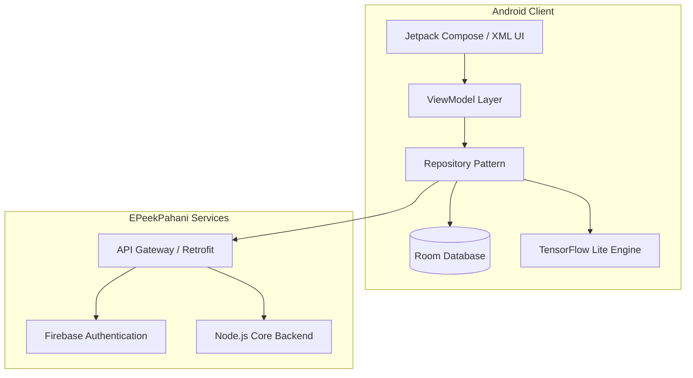

# SwaSurvey App - Technical Details

## System Architecture

Our architecture is designed for scale, resilience, and offline capability. Utilizing the modern Android MVVM pattern, we maintain a strict separation of concerns, ensuring high testability and smooth UI performance.

## Tech Stack

| Category | Technologies Used |
| :--- | :--- |
| **Frontend Platform** | Android SDK, Kotlin, XML / Jetpack Compose |
| **Architecture** | MVVM, Android Architecture Components, LiveData/Flow |
| **Local Database** | RoomDB, SQLite |
| **AI & ML Engine** | TensorFlow Lite, ML Kit (OCR & Image Labeling) |
| **Backend & APIs** | RESTful APIs, Retrofit2, OkHttp |
| **Location & Maps** | Google Maps SDK, Fused Location Provider |
| **Concurrency** | Kotlin Coroutines, WorkManager (for background sync) |

## End-to-End Workflow

1. **Authentication:** Farmer registers/authenticates.
2. **Data Capture:** Farmer captures Geotagged Crop Photo.
3. **Edge Processing:** Local ML models can optionally provide immediate feedback.
4. **Offline Storage:** Data is stored locally in RoomDB.
5. **Synchronization:** Background services (WorkManager) sync data via Retrofit to the Node.js backend when connectivity is detected.

## Security & Privacy

- **Encrypted Local Storage:** RoomDB instances can utilize SQLCipher to prevent unauthorized access.
- **Strict Permission Handling:** Camera and precise location permissions are requested *only* during the active photo-capture workflow.
- **Immutable Geotagging:** GPS coordinates attached to images are cryptographically signed to prevent spoofing using mock location apps.
