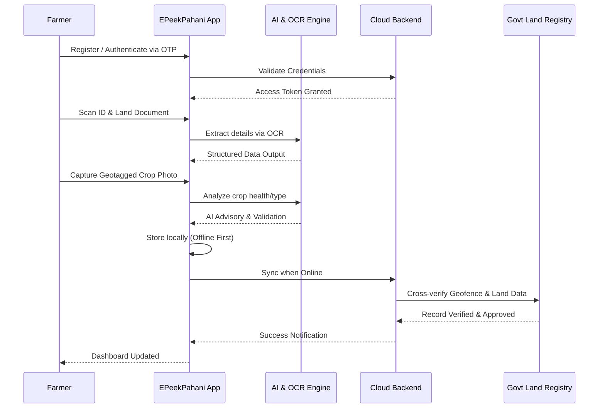
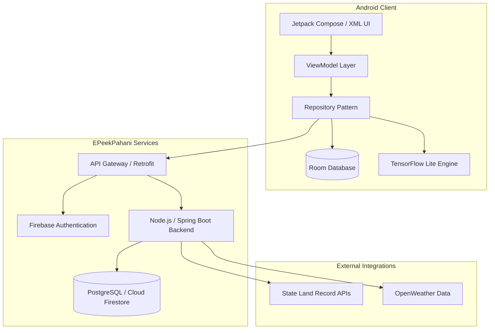

<div align="center">
  

  # EPeekPahani 🌱
  **Revolutionizing Agricultural Workflows through Digital Land Records & AI-Powered Farming.**

  *Empowering the rural ecosystem with transparent, modernized, and offline-first smart governance.*

  [](https://android.com)
  [](https://kotlinlang.org)
  [](#)
  [](https://opensource.org/licenses/MIT)
  [](#)
</div>

---

## 📖 About EPeekPahani

"Peek Pahani" is a traditional term deeply rooted in the agricultural administrative framework, referring to the physical inspection, verification, and recording of crops cultivated on a specific parcel of agricultural land. Historically, this meant manual ledgers, bureaucratic dependencies, and fragmented communication between the farmer and the government.

**EPeekPahani** represents a monumental leap forward—a digital transformation of this critical workflow. We are bringing transparency, speed, and autonomy back to the farmer. By placing a robust digital tool in the hands of the rural community, EPeekPahani eliminates bottlenecks and shifts the paradigm from centralized bureaucracy to decentralized, tech-enabled self-reporting. This is more than just an app; it is a vital bridge connecting rural agriculture with modern digital governance, ensuring farmers get the recognition, subsidies, and assistance they deserve.

## 🚀 Our Vision

To build an equitable agricultural ecosystem where every farmer has instant, transparent, and secure access to their land records, powered by accessible technology and artificial intelligence. We envision a future where digital infrastructure entirely eradicates rural documentation delays, enabling predictive, proactive, and hyper-efficient farming worldwide.

## ⚠️ The Problem Statement

Traditional agricultural documentation systems are broken, plagued by systemic inefficiencies that directly harm the very people they are meant to serve—the farmers.

* **Manual Redundancies:** Revenue officials manually transcribing data across thousands of acres leads to profound human error, lost files, and outdated land records.
* **Farmer Dependency:** Farmers are forced to endure long wait times at administrative offices to request their own land documents (such as 7/12 extracts) or verify their crop sowing status.
* **Corruption and Friction:** The lack of a transparent, trackable digital footprint creates environments ripe for exploitation, delayed disaster relief, and stalled crop insurance payouts.
* **Data Silos & Lack of Actionable Insights:** Paper-based records mean governments and agricultural bodies operate blindly. Without centralized data, proactive macro-level agricultural planning is practically impossible.
* **Digital Disconnect:** Existing digital solutions often ignore the reality of rural connectivity, failing entirely when offline or requiring complex navigation unsuited for the rural demographic.

## 💡 Solution Overview

**EPeekPahani** shatters these barriers by decentralizing data entry and democratizing access to land records. Built specifically for the Android platform, it offers an intuitive, accessible interface that understands the reality of rural infrastructure. 

We solve the crisis of agricultural documentation through:
* **Decentralized Self-Reporting:** Farmers leverage their smartphones to upload geotagged, timestamped images of their crops, instantly updating central repositories.
* **Offline-First Resilience:** A powerful local database architecture ensures that farmers can capture data deep in the fields without internet, syncing seamlessly once connectivity is restored.
* **AI-Assisted Workflows:** Beyond just record-keeping, embedded Machine Learning models analyze uploaded images to detect crop health and provide intelligent advisory.
* **OCR Automation:** Eliminating manual data entry by extracting text directly from official ID cards and old paper records using advanced optical character recognition.
* **Smart Dashboards:** Providing both farmers and administrators with a holistic, real-time view of crop distributions, weather anomalies, and actionable agricultural analytics.

## ✨ Core Features

* **🧑‍🌾 Secure Farmer Profiles:** Robust, Aadhaar-linked (or local ID) profile management that securely ties digital identity to physical land holdings.
* **📄 Digital Land Records:** Instantaneous digital fetching and verification of vital land documents (e.g., Satbara, Khata) directly within the app.
* **📷 Intelligent OCR Scanning:** Seamless extraction of textual data from physical documents, drastically reducing onboarding friction for users unfamiliar with typing.
* **🤖 AI Agriculture Assistant:** On-device TensorFlow Lite models that process crop images to detect blight, pests, and nutrient deficiencies.
* **📍 Precision Geofencing:** Mathematical validation of crop photos by cross-referencing embedded GPS metadata against government-registered land boundaries to prevent fraud.
* **📶 Robust Offline Synchronization:** Deep integration with local SQLite/RoomDB databases guarantees that no data is lost during network drops.
* **🌍 Multilingual UI:** Thoughtfully localized interface supporting multiple regional languages to ensure maximum accessibility for diverse farming communities.
* **📊 Analytics Dashboard:** Visual representations of crop yield history, soil health trends, and regional agricultural data.
* **🛡️ Admin / Revenue Controls:** A secure portal for government officials to quickly audit, approve, or flag farmer-submitted data in real-time.

## 🔄 End-to-End Workflow

EPeekPahani guarantees a smooth, frictionless user journey from installation to verified record storage.



## 🏗️ System Architecture

Our architecture is designed for scale, resilience, and offline capability. Utilizing the modern Android MVVM pattern, we maintain a strict separation of concerns, ensuring high testability and smooth UI performance.



## 🛠️ Tech Stack

EPeekPahani is built on a foundation of cutting-edge, industry-standard technologies to ensure long-term maintainability and high performance.

| Category | Technologies Used |
| :--- | :--- |
| **Frontend Platform** | Android SDK, Kotlin, XML / Jetpack Compose |
| **Architecture** | MVVM, Android Architecture Components, LiveData/Flow |
| **Local Database** | RoomDB, SQLite |
| **AI & ML Engine** | TensorFlow Lite, ML Kit (OCR & Image Labeling) |
| **Backend & APIs** | Firebase (Auth, Crashlytics), RESTful APIs, Retrofit2, OkHttp |
| **Location & Maps** | Google Maps SDK, Fused Location Provider |
| **Concurrency** | Kotlin Coroutines, WorkManager (for background sync) |
| **Build & Dev Tools** | Gradle, Android Studio, Git, GitHub Actions |

## 🚀 Installation & Setup

We've designed the setup process to be as straightforward as possible for contributors and hackathon judges.

### Prerequisites
* **Android Studio:** Ladybug or latest stable version.
* **Java Development Kit:** JDK 21.
* **Android SDK:** API Level 34 (Minimum API 24).
* **OS:** Windows 10/11, macOS, or Linux.

### 1. Clone the Repository
Open your preferred terminal or PowerShell and run:
```powershell
git clone https://github.com/Shambhavi500/EPeekPahani.git
cd EPeekPahani
```

### 2. Configure Local Properties
You must provide the path to your Android SDK. Create a file named `local.properties` in the root directory:
```properties
# D:\Projects\EPeekPahani\local.properties
sdk.dir=C\:\\Users\\YourUsername\\AppData\\Local\\Android\\Sdk
MAPS_API_KEY="your_google_maps_api_key_here"
```

### 3. Build the Project
Sync the project with Gradle files in Android Studio, or build via command line to resolve dependencies:
```powershell
.\gradlew.bat clean build
```

### 4. Run the Application
Launch an Android Virtual Device (AVD) or connect a physical device via USB debugging. Execute the following to install the debug APK:
```powershell
.\gradlew.bat assembleDebug
.\gradlew.bat installDebug
```

## 🛡️ Security & Privacy

Handling sensitive land records requires uncompromising security. EPeekPahani implements defense-in-depth:
* **End-to-End Encryption:** All data transmitted between the Android client and the backend is secured via TLS 1.3.
* **Encrypted Local Storage:** RoomDB instances utilize SQLCipher to prevent unauthorized access to local offline data if the device is compromised.
* **Strict Permission Handling:** Camera and precise location permissions are requested *only* during the active photo-capture workflow, respecting user privacy.
* **Immutable Geotagging:** GPS coordinates attached to images are cryptographically signed to prevent spoofing using mock location apps.
* **Token-Based Auth:** Secure JWT / Firebase authentication ensures that sessions are properly managed and timed out.

## 🔮 Future Scope

EPeekPahani is a living platform. Our roadmap includes ambitious integrations to further revolutionize AgriTech:
* **Blockchain-Backed Land Registries:** Transitioning verified land records onto a distributed ledger for absolute immutability and transparent land transfers.
* **Drone & Satellite Integration:** Correlating farmer-uploaded ground truth images with multispectral satellite data (e.g., Sentinel-2) to assess regional crop health.
* **IoT Farming Sensors:** Real-time API integrations with field sensors tracking soil moisture, pH levels, and ambient temperature.
* **Predictive Market Pricing:** Advanced AI modules that advise farmers on the optimal time and market to sell their yield based on global commodities forecasting.
* **Comprehensive GovTech Ecosystem:** Expanding APIs to integrate directly with national agricultural subsidy and crop insurance platforms.

## 🚧 Development Challenges

Building a production-grade AgriTech platform in a condensed timeframe posed significant engineering hurdles:
* **Offline Synchronization Logic:** Designing a robust conflict-resolution strategy for the Room database to ensure seamless synchronization when a device transitions from offline to online.
* **AI Model Optimization:** Balancing accuracy and performance by compressing TensorFlow Lite models so they run smoothly on low-end, budget smartphones common in rural areas.
* **Geofencing Accuracy:** Mitigating GPS jitter and ensuring high-fidelity location locking in remote areas without relying heavily on cell tower triangulation.
* **Toolchain Compatibility:** Navigating Gradle dependency conflicts, JDK 21 alignment, and Kotlin versioning during rapid iteration.

## 📸 Demo & Screenshots

> *Note: UI Assets and Demo videos will be populated here.*

| User Dashboard | Digital Land Record | AI Advisory & OCR |
| :---: | :---: | :---: |
|  |  |  |

**[▶️ Watch the Full Demo Presentation Here](#)**  
**[⬇️ Download the Latest Release APK](#)**

## 👥 Contributors

This project is driven by a passion for technology and social impact.

| Name | Role | GitHub |
| :--- | :--- | :--- |
| **Shambhavi Patil** | Lead Engineer & Architect | [@Shambhavi500](https://github.com/Shambhavi500) |
| *Open to Contributions!* | Join the movement. | |

*Interested in contributing? Please read our [CONTRIBUTING.md](#) guidelines.*

## 📄 License

This software is released under the [MIT License](LICENSE). You are free to use, modify, and distribute it, provided proper attribution is given.

---
<div align="center">
  <h3>EPeekPahani</h3>
  <i>Transforming Agriculture Through Technology. Empowering Farmers Digitally. 🌍🌾</i>
</div>
