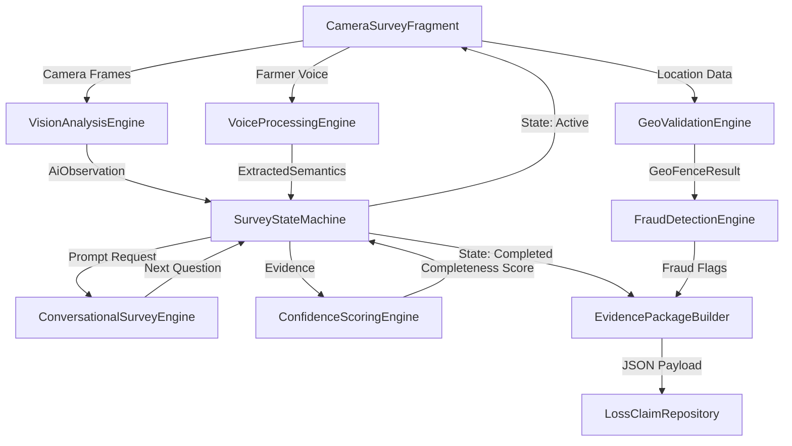
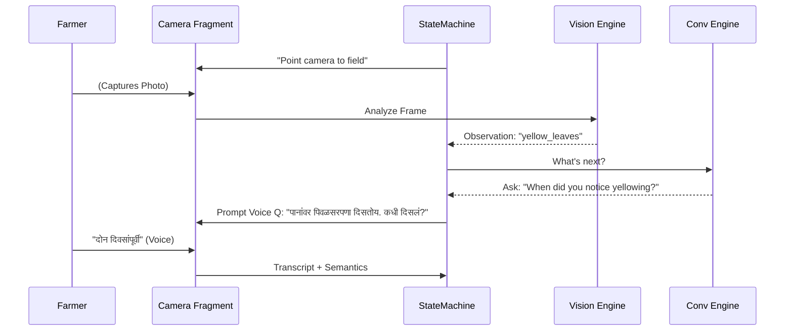

# AI-Guided Conversational Crop Survey System Architecture

## 1. High-Level Multi-Agent Architecture

The PMFBY Smart e-Peek Pahani app has been refactored into a decentralized, multi-agent architecture. Instead of a linear static form, the application acts as an orchestrator `SurveyStateMachine` that coordinates inputs and analysis across multiple independent engines.



## 2. Core Modules and Engines

### `SurveyStateMachine`
**Role**: The central nervous system.
**Behavior**: Holds immutable `SurveyState`. Listens for inputs (voice, visual) and requests the `ConversationalSurveyEngine` for the next logical step. Uses the `ConfidenceScoringEngine` to dynamically compress the survey (adaptive branching).

### `ConversationalSurveyEngine`
**Role**: AI Dialogue generation.
**Behavior**: Decides the next question and interaction mode (`CAPTURE_PHOTO`, `VERBAL_CONFIRM`). Generates prompts explicitly tailored to rural literacy levels.

### `VoiceProcessingEngine`
**Role**: Auditory semantic mapping.
**Behavior**: Translates unstructured local language speech (Marathi/Hindi) into structured keys.
Example: `"दोन दिवस पाणी होतं"` -> `{"flood_duration_days": 2, "water_present": true}`

### `VisionAnalysisEngine`
**Role**: Unbiased Evidence Collector.
**Behavior**: Assesses photo clarity and registers specific markers (`waterlogging`, `yellow_leaves`) strictly as evidence attributes, without concluding an absolute agronomic diagnosis.

### `ConfidenceScoringEngine`
**Role**: Adaptive Compression.
**Behavior**: Calculates an evidence confidence score (0-100). If visual evidence aligns heavily with farmer STT transcripts, the engine allows the `SurveyStateMachine` to skip redundant questions, shortening the flow.

### `FraudDetectionEngine` & `GeoValidationEngine`
**Role**: Security.
**Behavior**: Verifies continuous GPS trajectory, detects spoofing, mock API triggers, and identifies anomalous behavior like excessively short survey completion times. Triggers an `AUTO_REJECT` flag if severe.

### `EvidencePackageBuilder`
**Role**: Final consolidation.
**Behavior**: Packages all the artifacts (audio paths, transcripts, semantics, observations, GPS variances) into a clean JSON standard.

## 3. UI/UX Interaction Layer (Camera Overlay Guides)

The system introduces a voice-first camera UI driven by the StateMachine's `QuestionType`. 

1. **`INFO`**: App reads instructions out loud via TTS.
2. **`CAPTURE_PHOTO`**: Camera UI presents targeting guides depending on the observation context (e.g., "Bring camera closer to leaf").
3. **`VERBAL_CONFIRM`**: UI swaps to a "Hold to Speak" button, acting as a direct microphone line.

## 4. Suggested Folder Structure

```
com.example.clonee_peekpahani
├── data
│   ├── local
│   │   ├── dao
│   │   └── entity
│   └── remote
├── di                     # Hilt Dependency Injection Modules
├── lossclaim
│   ├── data               # DAOs and Entities specific to claim
│   ├── domain
│   │   ├── engine         # THE MULTI-AGENT ENGINES
│   │   │   ├── ConfidenceScoringEngine.kt
│   │   │   ├── ConversationalSurveyEngine.kt
│   │   │   ├── EvidencePackageBuilder.kt
│   │   │   ├── FraudDetectionEngine.kt
│   │   │   ├── SurveyStateMachine.kt
│   │   │   ├── VisionAnalysisEngine.kt
│   │   │   └── VoiceProcessingEngine.kt
│   │   └── model          # Immutable Data Contracts
│   │       └── SurveyModels.kt
│   ├── ui                 # Fragments and Camera Interfaces
│   └── viewmodel          # StateFlow integration
├── ui
└── utils                  # GeoValidationEngine, etc.
```

## 5. Flow Diagram: Dynamic Branching Example


